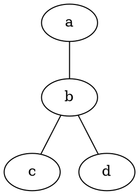
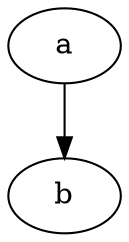
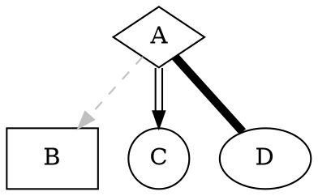
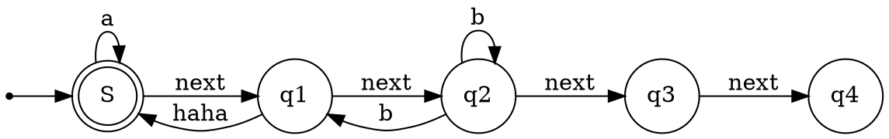
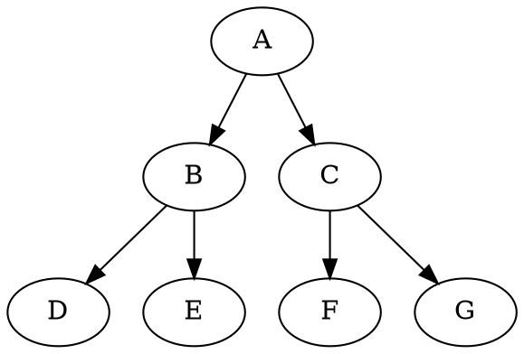
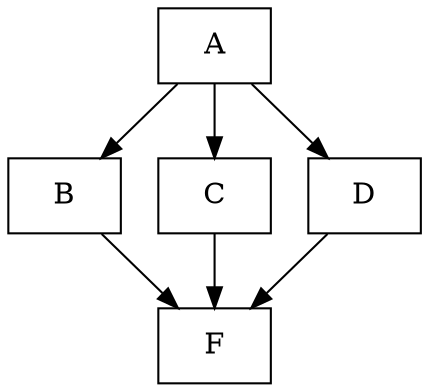
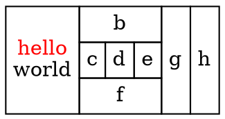
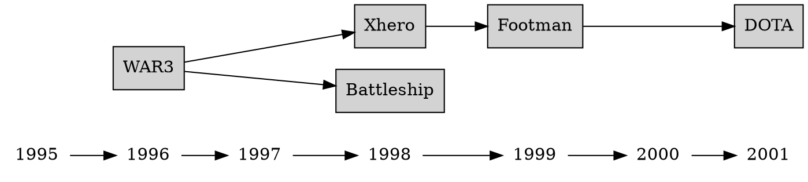
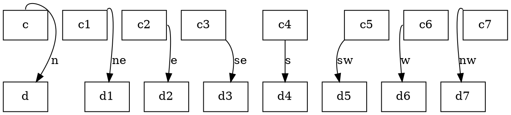
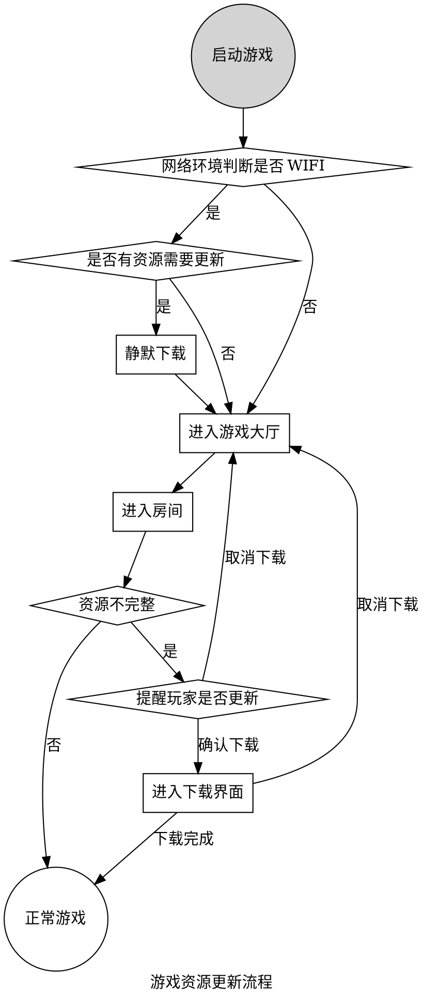

## 一、Graphviz简介

Graphviz是一个可以在Linux、macOS、Windows和Solaris系统上使用的开源图表可视化工具，它能使你具备用文本画图的能力，画出来的图形可导出为图片、SVG、PDF等格式。使用Graphviz之前需要先安装，具体步骤参考官方文档：https://graphviz.gitlab.io/download/。提示：Mac系统使用`brew install graphviz`来安装，Windows系统则下载exe安装包进行安装，并且需要配置系统环境变量：


安装配置完成后，通过`dot -version`命令查看是否安装成功，成功会输出版本号等信息：


### 二、用命令行生成图片

现在，你可以在电脑上创建一个demo.dot文本，写入图形代码:



在终端/命令行进入该.dot文件所在目录，通过命令把它转换为需要输出的格式：

```
dot demo.dot –Tpng –o demo.png
```

恭喜你！成功画了一个图！打开demo.png，你将会看到这个图：


如果要输出svg格式：

```
dot demo.dot –Tsvg –o demo.svg
```

如果你使用VSCode编程，建议安装 Graphviz (dot) language support for Visual Studio Code 和 Graphviz Preview 插件：


### 二、使用dot语言画图

#### Demo1

graph方法是使用没有箭头的线连接节点，你还可以更改图形方向、形状及文字格式，用Graphviz画思维导图：

```graphviz
graph g {
    rankdir=LR  //方向左右
    dot语言->{简介,语法,示例}
    dot语言[shape=box,fontcolor=red]
    简介[color=red]
    语法[color=green]
    示例[color=blue]
    简介->{开源免费,UML绘图,导出svg}
    语法->{"digraph","graph"}
    "digraph"->导向图[label=可以制作带方向的导图]
    "graph"->无向图[label=可以制作不带方向的导图]
    }
```


#### Demo2

使用“digraph”画有箭头的线：




#### Demo3

改变节点的形状和连接线样式：




#### Demo4

可以用来画流程图：




#### Demo5-1

一棵简单的二叉树：




#### Demo5-2

别忘了节点形状是可以改变的：




更多形状：


#### Demo6

用html画表格：




#### Demo7

使用rank把节点排列成对齐的行（列）：




#### Demo8

用控制符"n","ne","e","se","s","sw","w"和"nw"指定连接线的起止位置：




#### Demo9

画流程图




如果要近一步学会使用Graphviz画图，你一定要浏览这个repo：https://github.com/huangz1990/redisbook1e-gallery


参考资料：

- Graphviz官网： http://www.graphviz.org/
- Graphviz官方dot指南文档《Drawing graphs with dot》：http://www.graphviz.org/pdf/dotguide.pdf
- Graphviz Tutorial 1.0 文档：https://graphviztutorial.readthedocs.io/zh_CN/latest/chap01.html
- DOT语言学习笔记：https://zhuanlan.zhihu.com/p/51578351
- Dot语言教程：[https://segmentfault.com/a/1190000004646829](https://segmentfault.com/a/1190000004646829)
- 《Redis 设计与实现》图片集：http://1e-gallery.redisbook.com/index.html
- windows下Graphviz安装及入门教程: https://blog.csdn.net/lanchunhui/article/details/49472949

